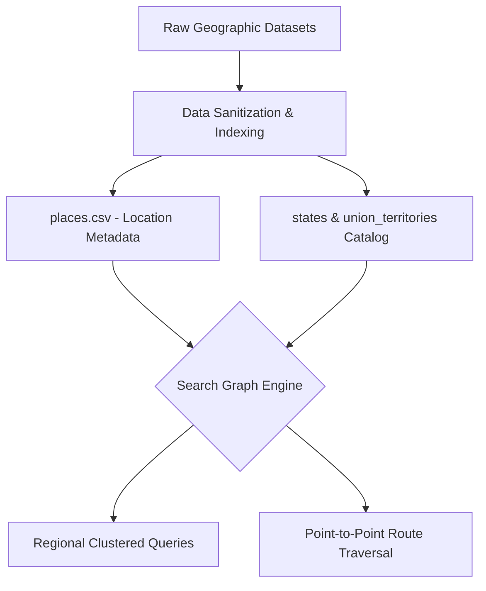

# 🧭 TECH-ON-TOUR

<div align="center">

### Intelligent Travel & Regional Exploration Graph Engine

[](https://github.com/Priya-Ranjan-0201)
[](https://github.com/Priya-Ranjan-0201/TECH-ON-TOUR)
[](https://github.com/Priya-Ranjan-0201)

[Overview](#-the-core-concept) • [Data Architecture](#-data-architecture--graph-structure) • [Data Pipeline](#-data-pipeline--flow) • [Quick Start](#-quick-start)

</div>

---

## 📌 The Core Concept

**TECH-ON-TOUR** is an engineering project focused on structuring, modeling, and querying rich regional tourism and geographic information across states and union territories. 

Rather than relying on unstructured web searches, the platform explores:
- **Relational & Graph-Based Exploration:** Connecting geographic regions, attractions, and cultural points of interest through structured datasets.
- **Search Graph Mechanics:** Modeling interconnected routes, regional clusters, and point-to-point traversal paths.
- **Structured Data Schemas:** Standardizing location attributes (coordinates, category, regional boundaries, connectivity).

---

## 🏗️ Data Architecture & Graph Structure



### Directory Structure
```text
TECH-ON-TOUR/
├── data/
│   ├── places.csv              # Standardized dataset of places, categories & metadata
│   ├── search_graph/           # Graph topology definitions and edge traversal mappings
│   ├── states/                 # State-wise boundary catalogs and localized spots
│   └── union_territories/      # Union territory geographic records
├── .gitignore                  # Git ignore rules
└── README.md                   # Project documentation
```

---

## ⚡ Key Features

- **Categorized Location Engine:** Structured records classifying destinations by heritage, nature, adventure, and regional significance.
- **Search Graph Traversal:** Graph structures designed to map proximity, neighbor nodes, and route paths.
- **Modular Regional Datasets:** Independent data files for states and union territories, allowing localized extensions without breaking the global index.

---

## 🚀 Quick Start

### 1. Clone Repository
```bash
git clone https://github.com/Priya-Ranjan-0201/TECH-ON-TOUR.git
cd TECH-ON-TOUR
```

### 2. Inspect Dataset (Python Example)
```python
import pandas as pd

# Load places dataset
df = pd.read_csv('data/places.csv')
print(f"Total destinations indexed: {len(df)}")
print(df.head())
```

---

## 🗺️ Roadmap

- [x] Structured regional dataset for States & Union Territories
- [x] Baseline search graph schema
- [ ] Automated route optimization algorithms (Dijkstra / A*)
- [ ] Interactive web interface with dynamic map visualization
- [ ] REST API endpoints for destination lookup and radius querying

---

## 📜 License

Distributed under the MIT License.

---

<div align="center">

Developed by **[Priya Ranjan](https://github.com/Priya-Ranjan-0201)**  
*Building at the intersection of AI, cybersecurity, and software systems.*

</div>
