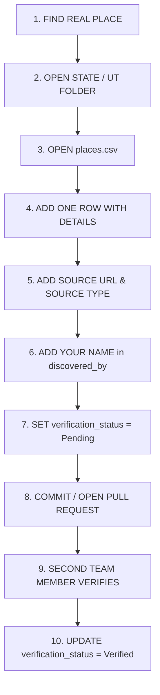

# Tech On Tour

> **Collaborative India Tourism Discovery Dataset**

Tech On Tour is building a comprehensive, collaborative dataset of India's famous, lesser-known, hidden, scenic, cultural, natural, and locally relevant tourism destinations for the **Tech On Tour** hackathon project.

The immediate goal is **ONLY DATA COLLECTION**. 

> [!IMPORTANT]
> **Data Collection Phase Only**: Do NOT build websites, AI models, recommendation engines, ML pipelines, backend services, frontend apps, APIs, or automated scoring systems yet. This repository provides the clean, collaborative data foundation for our team to find and catalogue genuine tourism destinations across India.

---

## Table of Contents

- [Repository Architecture](#repository-architecture)
- [Complete India Directory (36 Regions)](#complete-india-directory-36-regions)
  - [28 States](#28-states)
  - [8 Union Territories](#8-union-territories)
- [Team Member Workflow](#team-member-workflow)
- [Data Collection CSV Schema](#data-collection-csv-schema)
- [Categories Taxonomy](#categories-taxonomy)
- [Popularity & Crowd Levels](#popularity--crowd-levels)
- [The Hidden Gem Discovery Rule](#the-hidden-gem-discovery-rule)
- [Verification Process & Statuses](#verification-process--statuses)
- [Data Sources & Attribution](#data-sources--attribution)
- [Strict Rules & Guidelines](#strict-rules--guidelines)
  - [No Fake Data Policy](#no-fake-data-policy)
  - [Photo & Image Licensing](#photo--image-licensing)
  - [Do Not Overengineer](#do-not-overengineer)
- [Future Compatibility](#future-compatibility)

---

## Repository Architecture

The dataset is organized into regional folders covering all 28 States and 8 Union Territories:

```
Tech-On-Tour/
├── .gitignore
├── README.md
└── data/
    ├── states/
    │   ├── Andhra_Pradesh/
    │   │   ├── places.csv
    │   │   └── README.md
    │   ├── Arunachal_Pradesh/
    │   │   ├── places.csv
    │   │   └── README.md
    │   └── ... (28 states total)
    └── union_territories/
        ├── Andaman_and_Nicobar_Islands/
        │   ├── places.csv
        │   └── README.md
        ├── Chandigarh/
        │   ├── places.csv
        │   └── README.md
        └── ... (8 union territories total)
```

Every State and Union Territory folder contains:
1. `places.csv` — The standardized 27-column dataset file.
2. `README.md` — Region-specific instructions, checklists, and metadata.

---

## Complete India Directory (36 Regions)

Total Regions: **36** (**28 States** + **8 Union Territories**)

### 28 States

| # | State | Folder | Dataset | Guide |
|---|---|---|---|---|
| 1 | Andhra Pradesh | `data/states/Andhra_Pradesh/` | [places.csv](data/states/Andhra_Pradesh/places.csv) | [README.md](data/states/Andhra_Pradesh/README.md) |
| 2 | Arunachal Pradesh | `data/states/Arunachal_Pradesh/` | [places.csv](data/states/Arunachal_Pradesh/places.csv) | [README.md](data/states/Arunachal_Pradesh/README.md) |
| 3 | Assam | `data/states/Assam/` | [places.csv](data/states/Assam/places.csv) | [README.md](data/states/Assam/README.md) |
| 4 | Bihar | `data/states/Bihar/` | [places.csv](data/states/Bihar/places.csv) | [README.md](data/states/Bihar/README.md) |
| 5 | Chhattisgarh | `data/states/Chhattisgarh/` | [places.csv](data/states/Chhattisgarh/places.csv) | [README.md](data/states/Chhattisgarh/README.md) |
| 6 | Goa | `data/states/Goa/` | [places.csv](data/states/Goa/places.csv) | [README.md](data/states/Goa/README.md) |
| 7 | Gujarat | `data/states/Gujarat/` | [places.csv](data/states/Gujarat/places.csv) | [README.md](data/states/Gujarat/README.md) |
| 8 | Haryana | `data/states/Haryana/` | [places.csv](data/states/Haryana/places.csv) | [README.md](data/states/Haryana/README.md) |
| 9 | Himachal Pradesh | `data/states/Himachal_Pradesh/` | [places.csv](data/states/Himachal_Pradesh/places.csv) | [README.md](data/states/Himachal_Pradesh/README.md) |
| 10 | Jharkhand | `data/states/Jharkhand/` | [places.csv](data/states/Jharkhand/places.csv) | [README.md](data/states/Jharkhand/README.md) |
| 11 | Karnataka | `data/states/Karnataka/` | [places.csv](data/states/Karnataka/places.csv) | [README.md](data/states/Karnataka/README.md) |
| 12 | Kerala | `data/states/Kerala/` | [places.csv](data/states/Kerala/places.csv) | [README.md](data/states/Kerala/README.md) |
| 13 | Madhya Pradesh | `data/states/Madhya_Pradesh/` | [places.csv](data/states/Madhya_Pradesh/places.csv) | [README.md](data/states/Madhya_Pradesh/README.md) |
| 14 | Maharashtra | `data/states/Maharashtra/` | [places.csv](data/states/Maharashtra/places.csv) | [README.md](data/states/Maharashtra/README.md) |
| 15 | Manipur | `data/states/Manipur/` | [places.csv](data/states/Manipur/places.csv) | [README.md](data/states/Manipur/README.md) |
| 16 | Meghalaya | `data/states/Meghalaya/` | [places.csv](data/states/Meghalaya/places.csv) | [README.md](data/states/Meghalaya/README.md) |
| 17 | Mizoram | `data/states/Mizoram/` | [places.csv](data/states/Mizoram/places.csv) | [README.md](data/states/Mizoram/README.md) |
| 18 | Nagaland | `data/states/Nagaland/` | [places.csv](data/states/Nagaland/places.csv) | [README.md](data/states/Nagaland/README.md) |
| 19 | Odisha | `data/states/Odisha/` | [places.csv](data/states/Odisha/places.csv) | [README.md](data/states/Odisha/README.md) |
| 20 | Punjab | `data/states/Punjab/` | [places.csv](data/states/Punjab/places.csv) | [README.md](data/states/Punjab/README.md) |
| 21 | Rajasthan | `data/states/Rajasthan/` | [places.csv](data/states/Rajasthan/places.csv) | [README.md](data/states/Rajasthan/README.md) |
| 22 | Sikkim | `data/states/Sikkim/` | [places.csv](data/states/Sikkim/places.csv) | [README.md](data/states/Sikkim/README.md) |
| 23 | Tamil Nadu | `data/states/Tamil_Nadu/` | [places.csv](data/states/Tamil_Nadu/places.csv) | [README.md](data/states/Tamil_Nadu/README.md) |
| 24 | Telangana | `data/states/Telangana/` | [places.csv](data/states/Telangana/places.csv) | [README.md](data/states/Telangana/README.md) |
| 25 | Tripura | `data/states/Tripura/` | [places.csv](data/states/Tripura/places.csv) | [README.md](data/states/Tripura/README.md) |
| 26 | Uttar Pradesh | `data/states/Uttar_Pradesh/` | [places.csv](data/states/Uttar_Pradesh/places.csv) | [README.md](data/states/Uttar_Pradesh/README.md) |
| 27 | Uttarakhand | `data/states/Uttarakhand/` | [places.csv](data/states/Uttarakhand/places.csv) | [README.md](data/states/Uttarakhand/README.md) |
| 28 | West Bengal | `data/states/West_Bengal/` | [places.csv](data/states/West_Bengal/places.csv) | [README.md](data/states/West_Bengal/README.md) |

### 8 Union Territories

| # | Union Territory | Folder | Dataset | Guide |
|---|---|---|---|---|
| 1 | Andaman and Nicobar Islands | `data/union_territories/Andaman_and_Nicobar_Islands/` | [places.csv](data/union_territories/Andaman_and_Nicobar_Islands/places.csv) | [README.md](data/union_territories/Andaman_and_Nicobar_Islands/README.md) |
| 2 | Chandigarh | `data/union_territories/Chandigarh/` | [places.csv](data/union_territories/Chandigarh/places.csv) | [README.md](data/union_territories/Chandigarh/README.md) |
| 3 | Dadra and Nagar Haveli and Daman and Diu | `data/union_territories/Dadra_and_Nagar_Haveli_and_Daman_and_Diu/` | [places.csv](data/union_territories/Dadra_and_Nagar_Haveli_and_Daman_and_Diu/places.csv) | [README.md](data/union_territories/Dadra_and_Nagar_Haveli_and_Daman_and_Diu/README.md) |
| 4 | Delhi | `data/union_territories/Delhi/` | [places.csv](data/union_territories/Delhi/places.csv) | [README.md](data/union_territories/Delhi/README.md) |
| 5 | Jammu and Kashmir | `data/union_territories/Jammu_and_Kashmir/` | [places.csv](data/union_territories/Jammu_and_Kashmir/places.csv) | [README.md](data/union_territories/Jammu_and_Kashmir/README.md) |
| 6 | Ladakh | `data/union_territories/Ladakh/` | [places.csv](data/union_territories/Ladakh/places.csv) | [README.md](data/union_territories/Ladakh/README.md) |
| 7 | Lakshadweep | `data/union_territories/Lakshadweep/` | [places.csv](data/union_territories/Lakshadweep/places.csv) | [README.md](data/union_territories/Lakshadweep/README.md) |
| 8 | Puducherry | `data/union_territories/Puducherry/` | [places.csv](data/union_territories/Puducherry/places.csv) | [README.md](data/union_territories/Puducherry/README.md) |

---

## Team Member Workflow

Contributing is simple, fast, and structured:



### Quick Workflow Steps:
1. **FIND PLACE**: Discover a real tourist attraction, hidden gem, scenic viewpoint, or local cultural/food spot.
2. **OPEN STATE/UT FOLDER**: Navigate to `data/states/<State_Name>/` or `data/union_territories/<UT_Name>/`.
3. **OPEN `places.csv`**: Open the regional CSV file in your text editor, VS Code, or spreadsheet software.
4. **ADD ONE ROW**: Fill in all available fields following the schema.
5. **ADD SOURCE**: Include a legitimate, working `source_url` and specify the `source_type`.
6. **ADD YOUR NAME**: Enter your full name in `discovered_by` and current date (`YYYY-MM-DD`) in `date_added`.
7. **SET STATUS = Pending**: Every new entry must start with `Pending`.
8. **COMMIT / PULL REQUEST**: Commit your change with a descriptive message (e.g. `feat(kerala): add Meenmutty Falls hidden gem`).
9. **PEER VERIFICATION**: Another team member checks coordinates, sources, and factual accuracy.
10. **SET STATUS = Verified**: Once verified, change status to `Verified`.

---

## Data Collection CSV Schema

Every `places.csv` across all 36 regions contains the exact same **27 columns** in this precise order:

```csv
place_name,state_ut,district,city_or_town,nearest_major_city,category,subcategory,description,why_visit,hidden_gem,hidden_gem_reason,best_time_to_visit,best_season,activities,estimated_visit_duration,latitude,longitude,distance_from_nearest_famous_place,popularity_level,crowd_level,image_url,source_url,source_type,discovered_by,date_added,verification_status,notes
```

### Detailed Field Definitions

| # | Column Name | Type | Example / Allowed Values | Description |
|---|---|---|---|---|
| 1 | `place_name` | String | `"Kaas Plateau"`, `"Gandikota Canyon"` | Official or locally recognized name of the attraction. |
| 2 | `state_ut` | String | `"Maharashtra"`, `"Ladakh"` | Name of the State or Union Territory. |
| 3 | `district` | String | `"Satara"`, `"Kadapa"` | Official district where the place is located. |
| 4 | `city_or_town` | String | `"Satara"`, `"Jammalamadugu"` | Nearest town or village. |
| 5 | `nearest_major_city` | String | `"Pune"`, `"Bengaluru"` | Nearest major transport / airport hub. |
| 6 | `category` | String | `Nature`, `Waterfall`, `Heritage`, `Viewpoint` | Primary classification (choose from standard categories). |
| 7 | `subcategory` | String | `"Valley of Flowers"`, `"Gorge"`, `"Stepwell"` | Specific subcategory or subtype. |
| 8 | `description` | String | Short narrative overview | Concise summary of what this place is. |
| 9 | `why_visit` | String | Key highlights and appeal | Distinct reason why a traveler should visit. |
| 10 | `hidden_gem` | Enum | `Yes`, `No` | Is this place a lesser-known / under-visited spot? |
| 11 | `hidden_gem_reason` | String | `"Known mainly by locals, uncrowded alternative"` | Required if `hidden_gem=Yes`. Explain why. |
| 12 | `best_time_to_visit` | String | `"October to March"`, `"August to October"` | Specific months or time of day. |
| 13 | `best_season` | String | `"Monsoon"`, `"Winter"`, `"Post-Monsoon"` | Best season for peak experience. |
| 14 | `activities` | String | `"Trekking; Photography; Camping"` | Semicolon-separated list of things to do. |
| 15 | `estimated_visit_duration` | String | `"2-3 hours"`, `"Half Day"`, `"Full Day"` | Realistic duration needed to explore. |
| 16 | `latitude` | Float | `17.7214` | Decimal latitude (WGS 84). Leave blank if unverified. |
| 17 | `longitude` | Float | `73.8211` | Decimal longitude (WGS 84). Leave blank if unverified. |
| 18 | `distance_from_nearest_famous_place` | String | `"25 km from Mahabaleshwar"` | Distance and reference to a known landmark. |
| 19 | `popularity_level` | Enum | `Famous`, `Popular`, `Lesser-Known`, `Hidden`, `Emerging` | Relative popularity status based on evidence. |
| 20 | `crowd_level` | Enum | `Very Low`, `Low`, `Moderate`, `High`, `Very High`, `Unknown` | General tourist crowd density. |
| 21 | `image_url` | URL | Link to licensed image or Wikimedia file | Web URL to a representative image (verify license). |
| 22 | `source_url` | URL | Government / Wikimedia / Blog URL | Verifiable link where this destination was documented. |
| 23 | `source_type` | Enum / String | `Official Tourism`, `Wikipedia`, `Personal Discovery` | Origin category of the source information. |
| 24 | `discovered_by` | String | `"Priye Ranjan"`, `"Team Member Name"` | Contributor name who discovered/added the record. |
| 25 | `date_added` | Date | `2026-09-03` | Date added in `YYYY-MM-DD` format. |
| 26 | `verification_status` | Enum | `Pending`, `Verified`, `Needs Review`, `Rejected` | Initial value must be `Pending`. |
| 27 | `notes` | String | Accessibility notes, permits required, road conditions | Any extra helpful notes or tips for travelers. |

> [!TIP]
> If a value is unknown (e.g. precise coordinates or entry fee notes), **leave it blank**. Never invent numbers or fake coordinates.

---

## Categories Taxonomy

To keep data structured for downstream analysis, use these standard primary categories:

| Natural & Landscapes | Adventure & Outdoor | Heritage & History | Culture & Local Life | Food & Drink | Leisure & Lifestyle |
|---|---|---|---|---|---|
| `Nature` | `Trekking` | `Heritage` | `Culture` | `Food` | `Wellness` |
| `Waterfall` | `Hiking` | `Historical` | `Village` | `Street Food` | `Spiritual` |
| `Lake` | `Adventure` | `Monument` | `Local Experience` | `Restaurant` | `Family` |
| `Beach` | `Camping` | `Fort` | `Festival` | `Cafe` | `Romantic` |
| `Island` | `Wildlife` | `Temple` | `Market` | `Market` | `Shopping` |
| `Mountain` | `Bird Watching` | `Mosque` | `Handicraft` | | `Nightlife` |
| `Valley` | `Viewpoint` | `Church` | `Artisan` | | `Eco Tourism` |
| `Forest` | `Sunrise` | `Monastery` | `Rural Tourism` | | `Rural Tourism` |
| `River` | `Sunset` | `Archaeological` | | | `Other` |
| | `Photography` | `Museum` | | | |

---

## Popularity & Crowd Levels

### Popularity Levels
- `Famous` — Globally or nationally celebrated icon (e.g., Taj Mahal, Qutub Minar, Pangong Tso).
- `Popular` — Well-known regionally with steady tourist arrivals.
- `Lesser-Known` — Known to enthusiasts and locals, but rarely included in generic state tourist brochures.
- `Hidden` — Truly secluded or tucked away; minimal tourist footfall.
- `Emerging` — Destinations seeing recent organic interest through travel communities or new infrastructure.

### Crowd Levels
- `Very Low` — Often completely solitary, quiet, undisturbed.
- `Low` — Few visitors even during peak hours.
- `Moderate` — Steady visitors without feeling overcrowded.
- `High` — Large crowds during weekends and seasonal peaks.
- `Very High` — Extremely packed, long wait lines, heavy footfall.
- `Unknown` — Crowd data not yet established.

---

## The Hidden Gem Discovery Rule

Our highest project priority is identifying:
> **"Beautiful places that are not yet highly famous or overcrowded."**

When cataloguing any location:
1. Mark `hidden_gem` = `Yes` or `No`.
2. If `Yes`, you **must** justify it in `hidden_gem_reason`.

Valid justifications include:
- Less tourist traffic than nearby alternatives
- Primarily known to locals or native communities
- Not commonly featured in mainstream package itineraries
- Lesser-known viewpoint or vantage point
- Emerging scenic trail or secluded waterfall
- Beautiful architecture or historical site under-promoted by mainstream agencies
- High natural beauty with tranquil, low-impact atmosphere

> [!WARNING]
> Do NOT mark a place as a hidden gem without a substantiated reason.

---

## Verification Process & Statuses

Data integrity is vital. All team submissions follow this verification pipeline:

- `Pending` — Newly submitted entry. All new records must start with this status.
- `Verified` — A second team member has checked that:
  - The destination exists in real life.
  - The state/district and coordinates are accurate.
  - The source URL is accessible and legitimate.
  - The categorization is appropriate.
- `Needs Review` — Information is incomplete, ambiguous, or needs coordinate confirmation.
- `Rejected` — Place does not exist, is duplicate, inaccessible/dangerous without disclosure, or violates repository rules.

---

## Data Sources & Attribution

Team members should discover places using legitimate, factual sources:

- **Official Tourism**: State Tourism Development Corporations (e.g., KTDC, MTDC, RTDC), Ministry of Tourism (Incredible India).
- **Government Portals**: District administration portals (`<district>.nic.in`), Archaeological Survey of India (ASI).
- **Open Geographic Data**: OpenStreetMap, Wikidata, Wikipedia.
- **Travel Communities & Guides**: Reputed travel blogs, recognized travel journals, local guidebooks.
- **Multimedia & Video**: YouTube travel documentaries, vlogs with on-ground footage.
- **Personal Discovery / Local Knowledge**: First-hand visits or recommendations from native residents.

**Attribution Rule**:
Every row must provide `source_url` and a corresponding `source_type` (e.g., `Official Tourism`, `Wikipedia`, `Government`, `Travel Blog`, `Personal Discovery`).

---

## Strict Rules & Guidelines

### No Fake Data Policy
> [!CAUTION]
> **Strictly prohibited**:
> - NO imaginary or invented places
> - NO fabricated coordinates or random lat/long numbers
> - NO fake ratings, false visitor counts, or invented descriptions
> - NO AI-hallucinated tourism records
> 
> Only catalogue real places that exist on the map and can be confirmed. If a specific detail is unknown, leave that cell **empty**.

### Photo & Image Licensing
- Use `image_url` to point to a high-quality preview image.
- Only link to images where usage is legally permissible (e.g., Wikimedia Commons, Unsplash, Pexels, government public domain, Creative Commons, or your own original photos).
- Never scrape or hotlink copyrighted photos without rights.

### Do Not Overengineer
- This repository is dedicated purely to **clean data collection**.
- Do not add complex build tooling, web servers, AI models, scoring scripts, or premature backend frameworks to this repository during this phase.

---

## Future Compatibility

While this version is strictly for collaborative data collection, the CSV schema is fully normalized and future-proof. Once the data collection milestone is achieved, this dataset will directly integrate into:

- **Relational Databases**: PostgreSQL / PostGIS (spatial indexing on `latitude` and `longitude`)
- **Document Databases**: MongoDB collections
- **Data Science**: Python Pandas / Polars DataFrames
- **Machine Learning**: Itinerary builders, personalized recommendation engines, and collaborative filtering
- **Knowledge Graphs**: India Tourism Knowledge Graph (Nodes: Places, Districts, Categories; Edges: Proximity, Seasons)
- **AI Tourism Brain**: AI Hidden Gem Discovery assistants and web/mobile apps

---

*Tech On Tour Hackathon Team — Curating India's most authentic travel intelligence.*
